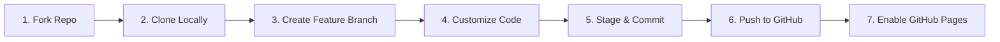

# 🚀 Developer Portfolio Starter | Git & GitHub Workshop Template

A modern, responsive, ultra-clean developer portfolio template built with **pure HTML5, Vanilla CSS3, and JavaScript (ES6+)**. 

Engineered specifically as an open-source hands-on project for **Git & GitHub Workshops** and designed for effortless continuous deployment to **GitHub Pages**.


---

## ✨ Features

- **100% Zero-Build Stack**: Built using standard HTML, CSS, and JS. No NPM, Node, Webpack, or external build step required!
- **GitHub Pages Ready**: Drop into any GitHub repository, enable Pages in repository settings, and it deploys live in under 60 seconds.
- **Dark / Light Mode**: Built-in theme switcher with `localStorage` state persistence.
- **Interactive Git CLI Terminal Simulator**: Embedded terminal widget for workshop attendees to test Git commands live in the browser.
- **Filterable Projects Showcase**: Category tabs (`All`, `Web Apps`, `Git Tools`, `Workshop Demos`) and project detail modals.
- **Responsive & Accessible**: Flexbox and CSS Grid layouts tuned for Desktop, Tablet, and Mobile screens with smooth micro-animations.
- **Guided Workshop Comments**: Cleanly commented HTML & CSS files pointing out exact places where workshop attendees should insert their name, bio, skills, and links.

---

## 🛠️ Workshop Hands-On Workflow

Follow this step-by-step guide during your workshop session:



### Step 1: Fork & Clone the Repository
1. Click the **Fork** button at the top-right of this GitHub repository page to create a copy under your account.
2. Open your terminal or Command Prompt and run:
   ```bash
   git clone https://github.com/YOUR-USERNAME/Git-Github-Workshop.git
   cd Git-Github-Workshop
   ```

### Step 2: Open & Run Locally
Simply open `index.html` in your browser, or use VS Code's **Live Server** extension:
```bash
# On macOS
open index.html

# On Windows
start index.html
```

### Step 3: Create a Feature Branch
Good practice in Git is to never commit directly on `main`. Create your feature branch:
```bash
git checkout -b feature/my-portfolio
```

### Step 4: Customize Your Portfolio
Open the project folder in your code editor and edit the following files:
- **`index.html`**:
  - Replace `Alex Rivera` with your actual name.
  - Update your bio paragraph in the `#about` section.
  - Edit your skills in `#skills` section and project cards in `#projects`.
  - Add your GitHub and social links in `#contact`.
- **`css/style.css`**:
  - Change CSS `:root` variables to try custom theme colors!

### Step 5: Stage & Commit Your Changes
Check your status, stage modified files, and commit:
```bash
# Check modified files
git status

# Stage all changes
git add .

# Create a clear commit message
git commit -m "Customize personal portfolio bio, skills, and contact links"
```

### Step 6: Push to GitHub
Push your feature branch to your GitHub remote repository:
```bash
git push -u origin feature/my-portfolio
```

### Step 7: Create a Pull Request & Merge to `main`
1. Go to your GitHub repository in your web browser.
2. Click **Compare & pull request**.
3. Review your changes and click **Create pull request**.
4. Click **Merge pull request** and confirm the merge to `main`.

### Step 8: Deploy Live on GitHub Pages 🌐
1. On GitHub, navigate to your repository's **Settings** tab.
2. In the left sidebar, click on **Pages**.
3. Under **Build and deployment** -> **Source**, select **Deploy from a branch**.
4. Set the branch to **`main`** / `(root)` and click **Save**.
5. Wait ~60 seconds, refresh the page, and your portfolio will be live at:
   `https://YOUR-USERNAME.github.io/Git-Github-Workshop/`

---

## 💡 Quick Git Command Reference

| Command | Purpose |
| :--- | :--- |
| `git init` | Initialize a new local Git repository |
| `git status` | Check working tree and staging area status |
| `git checkout -b <branch>` | Create and switch to a new branch |
| `git branch` | List all local branches |
| `git add .` | Stage all modified and new files |
| `git commit -m "msg"` | Save staged snapshot with descriptive message |
| `git log --oneline` | View succinct commit history log |
| `git push origin <branch>` | Upload local branch commits to GitHub |
| `git pull origin main` | Fetch and merge latest changes from GitHub |

---

## 📁 Repository File Structure

```
├── index.html          # Main portfolio layout with workshop comments
├── css/
│   └── style.css       # Custom properties, dark/light themes, animations
├── js/
│   └── main.js         # Theme toggle, filter tabs, terminal simulator, form validation
├── assets/
│   └── avatar.svg      # Developer illustration SVG asset
├── .gitignore          # Git ignore file for OS/editor metadata
└── README.md           # Workshop instructions & Git guide
```

---

## 📄 License

This template is released under the [MIT License](LICENSE). Feel free to use, modify, and distribute it for your own workshops or personal portfolio!
